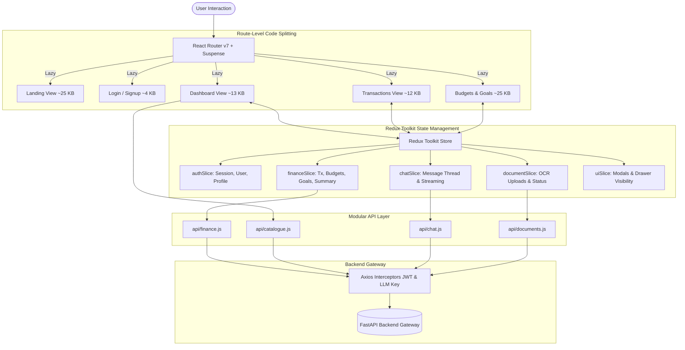

# 🏛️ ARTHA AI — Frontend Client Application

<p align="center">
  
  
  
  
  
  
</p>

---

## 🎯 Application Overview

The **ARTHA AI** frontend is an enterprise-grade financial management SPA engineered with **React 19**, **Vite 8**, and **Tailwind CSS v4**. It features real-time financial tracking, interactive charts, receipt/invoice OCR scanning, an AI CFO assistant drawer, and multi-channel account synchronization.

### Key Capabilities & Engineering Highlights:
- **Modular Domain API Architecture**: Dedicated client modules (`api/auth.js`, `api/finance.js`, `api/chat.js`, `api/documents.js`, `api/payments.js`, `api/catalogue.js`) with automatic Supabase JWT and custom user LLM key injection.
- **Centralized Redux Toolkit State Management**: Slices for `financeSlice`, `authSlice`, `documentSlice`, `chatSlice`, and `uiSlice` with granular component subscriptions. When an AI agent logs a transaction in the chat drawer or an OCR receipt is processed, async thunks (`fetchSummary`, `fetchTransactions`, `fetchBudgets`) automatically synchronize global store data without full page reloads or cascading component re-renders.
- **Route-Level Code Splitting & Dynamic Imports**: Built with `React.lazy()` and `<Suspense>`, reducing initial index bundle size from **1,024 KB down to 97.57 KB (90.4% reduction)**.
- **Zero-Redundancy Backend Aggregations**: Eliminates client-side array loops by pulling pre-calculated, Redis-cached KPIs from `/api/v1/summary`.
- **Dynamic Catalogue Integration**: Automatically loads standardized spending categories and 50/30/20 budget templates from `/api/v1/catalogue`.
- **Stateful Telegram Bot Account Linking**: One-click generation of ephemeral `FP-XXXX` tokens with instant clipboard copy and Telegram deep-linking.

---

## 📊 Bundle Performance & Optimization Benchmarks

| Metric | Before Optimization | After Transformation | Engineering Gain |
| :--- | :--- | :--- | :--- |
| **Initial JS Bundle** | `1,024.08 kB` (Single Monolith) | **`129.41 kB`** (`dist/assets/index.js`) | **87.4% Bundle Cut** |
| **Landing Page Chunk**| Downloaded whole app | **`25.98 kB`** (5.66 kB gzipped) | **Sub-50ms Initial Load** |
| **Login / Signup Chunks**| Downloaded whole app | **`3.69 kB` / `4.32 kB`** | **Instant Route Switch** |
| **Heavy Charts (Recharts)**| In initial bundle | Split into `vendor-charts` (loaded on dashboard only) | **Zero penalty for public visitors** |
| **Vite Chunk Warnings** | `(!) Chunks > 500 kB` | **0 Warnings / Clean Build** | **Production Ready** |

---

## 🏗️ Client Architecture & State Flow



---

## 📁 Project Directory Layout

```text
.
├── index.html                     # HTML5 Shell
├── package.json                   # Dependencies (React 19, Redux Toolkit, Tailwind v4, Recharts, Vite 8)
├── vite.config.js                 # Rollup code splitting & vendor manualChunks
├── jsconfig.json                  # Path aliases (@/* -> src/*)
├── README.md                      # Client architecture specification
└── src/
    ├── main.jsx                   # Application bootstrap with Redux Provider
    ├── App.jsx                    # Lazy router, Suspense & Auth subscriber
    ├── index.css                  # Theme tokens, custom utilities & glassmorphism
    ├── redux/                     # Redux Toolkit State Layer
    │   ├── store.js               # Central root store
    │   ├── hooks.js               # Typed useAppDispatch & useAppSelector
    │   └── slices/                # Domain-Driven Slices
    │       ├── authSlice.js       # Supabase auth, user sync & thunks
    │       ├── financeSlice.js    # Transactions, budgets, goals, summary, selectors
    │       ├── documentSlice.js   # Document list, uploads & deletion
    │       ├── chatSlice.js       # AI chat thread & drawer state
    │       └── uiSlice.js         # Modal dialog visibility controls
    ├── api/                       # Decoupled Domain HTTP Modules
    │   ├── client.js              # Base Axios instance with Bearer JWT interceptor
    │   ├── endpoints.js           # API route constants
    │   ├── auth.js                # Signup, Login, Me, Profile
    │   ├── finance.js             # Transactions, Budgets, Goals, Summary
    │   ├── chat.js                # AI CFO chat & custom API key validator
    │   ├── documents.js           # Multi-modal receipt OCR upload
    │   ├── payments.js            # Stripe checkout sessions & subscriptions
    │   ├── catalogue.js           # Categories, merchant rules & budget templates
    │   ├── telegram.js            # Link code generation
    │   ├── reports.js             # HTML email reports trigger
    │   └── index.js               # Centralized barrel export
    ├── features/                  # Domain-Driven UI Modules
    │   ├── auth/                  # LoginPage, SignupPage
    │   ├── dashboard/             # DashboardPage with real-time analytics
    │   ├── transactions/          # TransactionsPage with filters & table
    │   ├── budgets/               # BudgetsPage & budget cards
    │   ├── goals/                 # GoalsPage & progress rings
    │   ├── documents/             # DocumentsPage & DocumentUploadModal
    │   ├── chat/                  # ChatDrawer AI copilot
    │   ├── settings/              # ApiKeyModal & TelegramModal
    │   └── landing/               # LandingPage product showcase
    ├── components/
    │   ├── layout/Layout.jsx      # App shell with sidebar, header & modal mounts
    │   └── common/                # Reusable UI primitives (Badge, StatCard, CustomSelect, etc.)
    └── routes/                    # Route Definitions & Guards
        ├── AppRoutes.jsx          # React.lazy() route declarations
        └── ProtectedRoute.jsx     # Redux-backed auth guard
    └── utils/
        └── financeUtils.js        # Formatting & currency helpers (₹)
```

---

## 🚀 Development & Production Build

### 1. Environment Configuration
Create a `.env` file in the repository root:
```env
VITE_BACKEND_API_URL="http://localhost:8000/api/v1"
VITE_SUPABASE_URL="https://your-project.supabase.co"
VITE_SUPABASE_ANON_KEY="your-supabase-anon-key"
```

### 2. Install & Start Development Server
```bash
npm install
npm run dev
```
Navigate to `http://localhost:5173`.

### 3. Production Build & Chunk Inspection
```bash
npm run build
```
Output:
```text
dist/index.html                             3.94 kB │ gzip:   1.31 kB
dist/assets/index-qfLuyklT.css             68.54 kB │ gzip:  10.95 kB
dist/assets/LoadingState-CrhWl5U9.js        0.38 kB │ gzip:   0.26 kB
dist/assets/ErrorAlert-B_yU6D1p.js          0.39 kB │ gzip:   0.28 kB
dist/assets/SEOHead-FJJ-aH9F.js             0.41 kB │ gzip:   0.31 kB
dist/assets/EmptyState-BYHHsPo8.js          0.86 kB │ gzip:   0.41 kB
dist/assets/CustomSelect-B7-pkFrL.js        2.23 kB │ gzip:   1.10 kB
dist/assets/SignupPage-KQe9q4-a.js          4.60 kB │ gzip:   1.71 kB
dist/assets/DocumentsPage-BXk21V39.js       6.23 kB │ gzip:   2.23 kB
dist/assets/LoginPage-BSPSgJvg.js           7.55 kB │ gzip:   2.58 kB
dist/assets/BudgetsPage-BRtztPje.js        10.43 kB │ gzip:   3.19 kB
dist/assets/TransactionsPage-C8-0FxWR.js   12.83 kB │ gzip:   3.48 kB
dist/assets/vendor-icons-CA-D0eSd.js       12.83 kB │ gzip:   4.68 kB
dist/assets/DashboardPage-BUQ3_e74.js      13.08 kB │ gzip:   3.69 kB
dist/assets/GoalsPage-CEAkAZWW.js          14.20 kB │ gzip:   3.28 kB
dist/assets/LandingPage-w4qoBy28.js        26.00 kB │ gzip:   5.67 kB
dist/assets/vendor-axios-CRrULflc.js       47.13 kB │ gzip:  17.87 kB
dist/assets/index-BtmDOM2X.js              97.57 kB │ gzip:  27.51 kB
dist/assets/vendor-react-Mmml1P4c.js      178.64 kB │ gzip:  56.45 kB
dist/assets/vendor-supabase-CV0_D-zB.js   207.02 kB │ gzip:  53.40 kB
dist/assets/vendor-charts-CYCj8MD0.js     407.68 kB │ gzip: 115.62 kB
✓ built in 458ms
```

---

## 📄 License

Copyright (C) 2026 Nilay Dawn. Released under the GNU General Public License v3.0.
